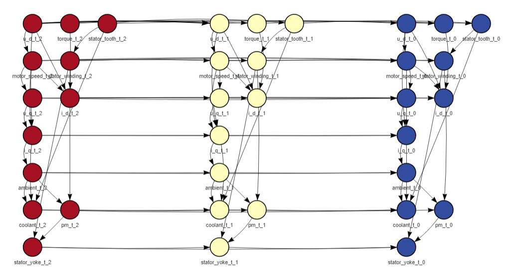

# rdbn

An implementation of Gaussian dynamic Bayesian networks (GDBN) structure learning and inference based on Marco Scutari's package bnlearn (http://www.bnlearn.com/). The structure learning algorithm implemented is a variation on Ghada Trabelsi's dynamic max-min hill climbing (https://tel.archives-ouvertes.fr/tel-00996061/document). The inference is performed via particle filtering. A visualization tool is implemented for GDBNs and bnlearn's BNs via the visNetwork package (https://github.com/datastorm-open/visNetwork).

## Getting Started

### Prerequisites

This package requires R ≥ 3.6.1 to work properly. It's possible to make it work for older versions of R and of each of the packages by fiddling with the [NAMESPACE](NAMESPACE) file, although this is not recommended.

The __bnlearn__ and __data.table__ packages are required for this package to work. They will be installed automatically when installing this this package. The can also be installed manually via CRAN with the command

```
install.packages(c("bnlearn", "data.table"))
```
The packages __visNetwork__, __magrittr__ and __grDevices__ are optional for the visualization tool. They will only be required if you want to use it.

### Installing


## Basic examples

To get the structure of a GDBN from a dataset, you need to use the function _learn_dbn_struc_

```{r quick usage, echo=TRUE, message=FALSE, warning=FALSE}
dt <- data.table::fread("data/pmsm_temperature_data_reduced.csv")
l_res <- learn_dbn_struc(dt, 2)
```
The dt argument has to be either a data.frame or a data.table of numeric columns, in the example we use the sample data set provided for the tests. The size argument determines the number of time slices that your net is gona have, that is, the Markovian order of the net. A Markovian order of 2 means that your data in the present is independent of the past given the previous time slice. If your case doesn't meet this criteria, the size of the net can be increased, to take into account more past time slices in the inference. In our function, Markovian order = size - 1. The function returns a list with the learned structure and the folded dataset with the extended rows.

Once the structure is learnt, it can be ploted and used to learn the parameters
```{r quick usage, echo=TRUE, message=FALSE, warning=FALSE}
plot_dynamic_network(l_res$net)
```


## License

This project is licensed under the GPL-3 License, following on bnlearn's GPL(≥ 2) license - see the [LICENSE](LICENSE) file for details

## References

* The bnlearn package (http://www.bnlearn.com/).
* The visNetwork package (https://datastorm-open.github.io/visNetwork/)
